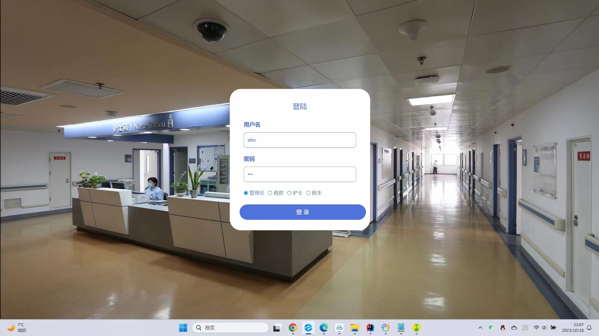
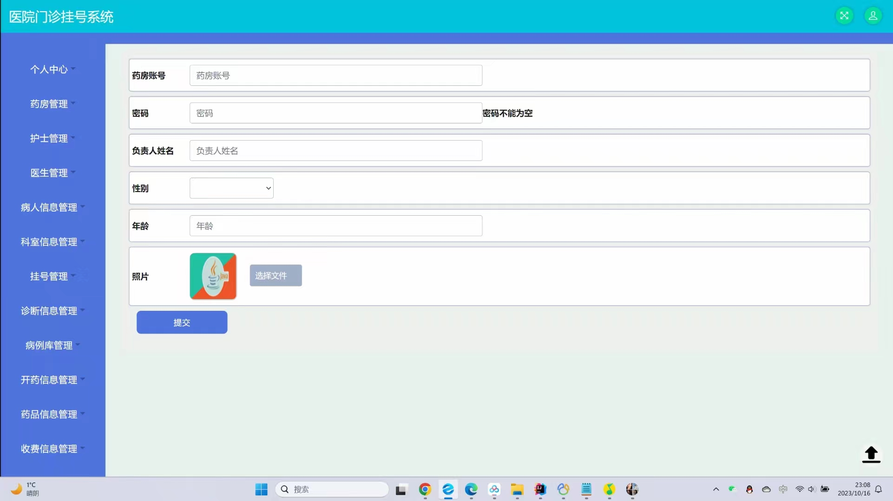
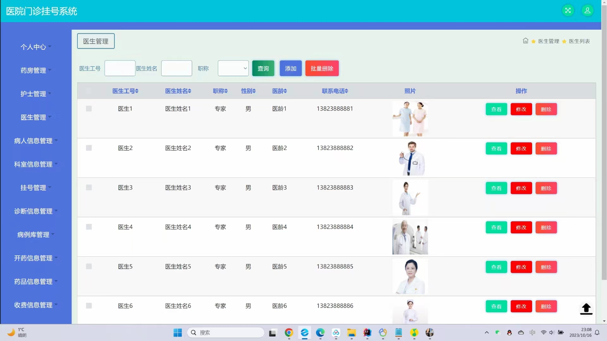
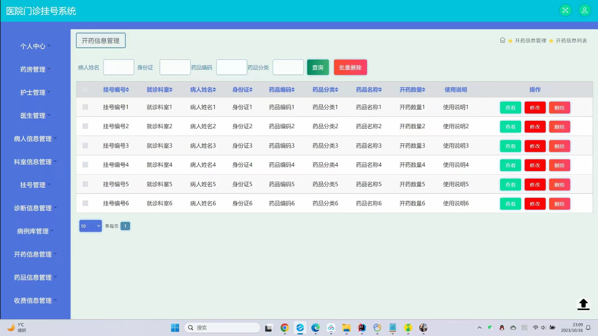
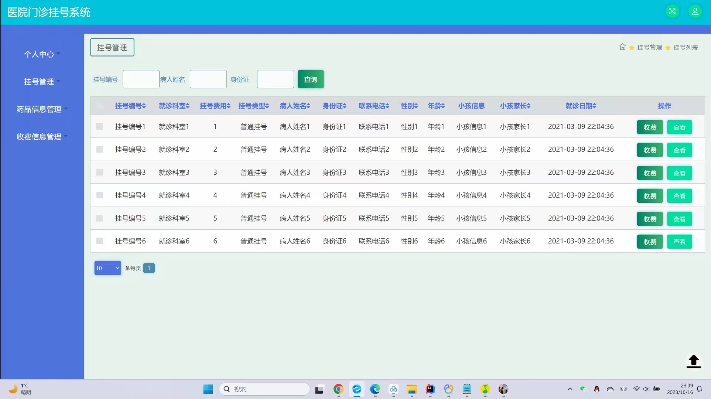
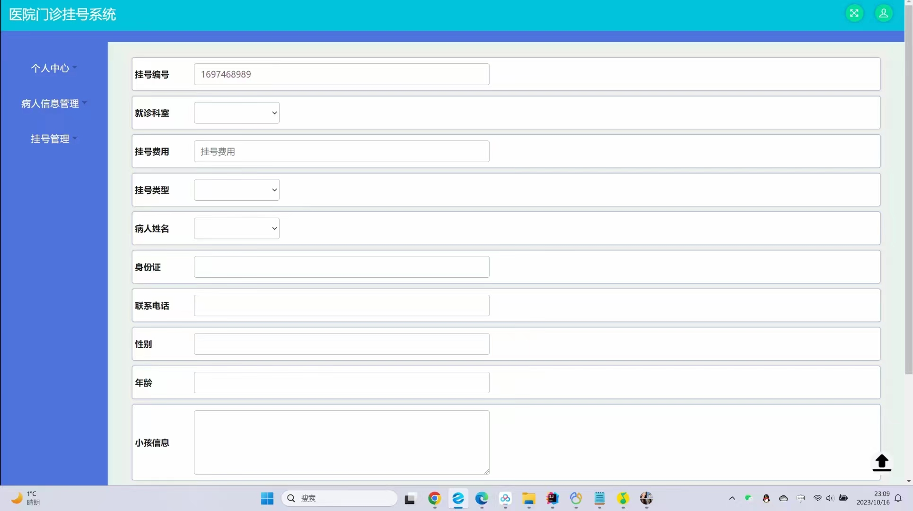
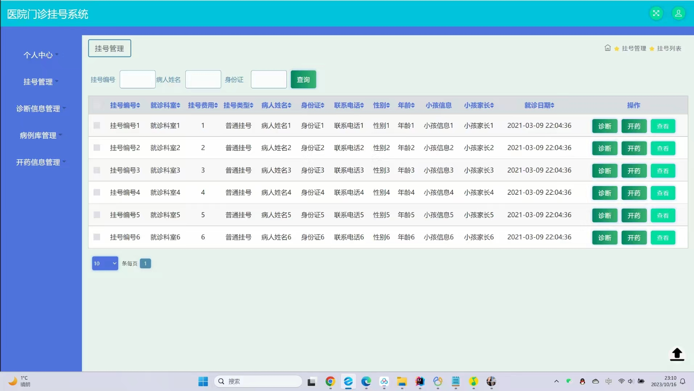
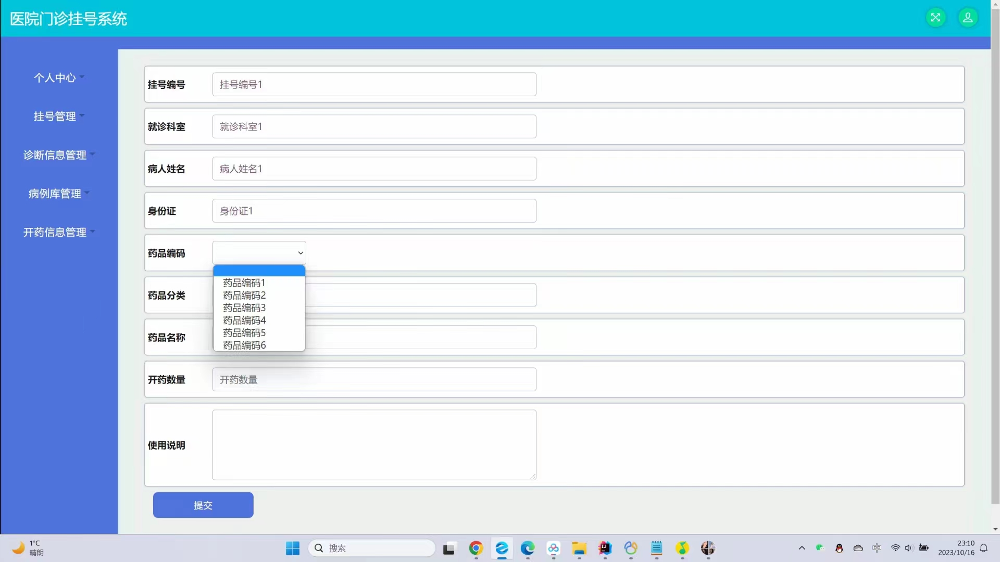

# 基于ssm008医院门诊预约系统设计与实现

#### 介绍
基于SSM的医院门诊预约系统设计与实现； 本项目包含：源码+数据库sql+开题报告+论文+说明文档 本项目可以用于毕业设计，白嫖勿扰！
全网毕业设计项目这里都有 更多项目源码可以私信联系：微信 -- 13283346760

#### 主要功能
##### 后台登录：4个角色
管理员：
①个人中心、修改密码、个人信息
②药房管理、护士管理、医生管理、病人信息管理、科室信息管理、挂号管理、诊断信息管理、病例库管理、开药信息管理、药品信息管理、收费信息管理
药房：
①个人中心、修改密码、个人信息
②挂号管理、药品信息管理、收费信息管理
护士：
①个人中心、修改密码、个人信息
②病人信息管理、挂号管理
医生：
①个人中心、修改密码、个人信息
②挂号管理、诊断信息管理、病例库管理、开药信息管理

#### 需要安装的软件
开发工具： idea
数据库：Mysql 5或8
服务器：Tomcat（版本随意）
后端框架：ssm
前端框架：jsp

#### 部署教程
1. 创建数据库jspmyu3xi，再运行数据库文件夹里的sql脚本，创建相应表
2. 修改config.properties中与Mysql数据库相关的信息
3. 配置maven依赖，jdk版本
4. 启动项目

#### 运行截图

#### 获取源码

白嫖勿扰

V：13283346760

Q：985089028

